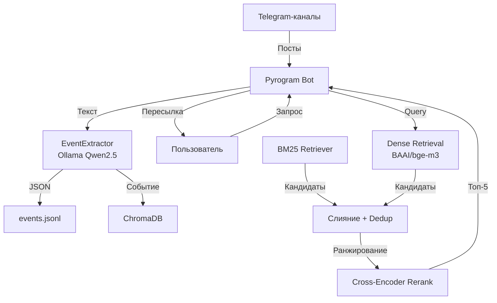

# EventMind RAG Bot

Система рекомендаций культурных мероприятий через Telegram на базе RAG.

## Описание

Бот мониторит Telegram-каналы с афишами мероприятий, автоматически извлекает структурированную информацию о событиях с помощью LLM и позволяет пользователям искать мероприятия через естественный язык.

## Архитектура



## Технологии

| Компонент | Технология |
|-----------|------------|
| Telegram-клиент | kurigram (Pyrogram fork) |
| LLM | Ollama + Qwen2.5 |
| Векторная база | ChromaDB |
| Embeddings | BAAI/bge-m3 |
| Полнотекстовый поиск | BM25 (LangChain) |
| Reranking | DiTy/cross-encoder-russian-msmarco |
| Валидация | Pydantic |


## Установка

### Требования

- Python 3.12
- Ollama (локальный сервер)
- Telegram API credentials

### Шаг 1: Установка зависимостей

```bash
pip install -r requirements.txt
```

### Шаг 2: Настройка Ollama

```bash
# Установите Ollama с https://ollama.ai
ollama pull qwen2.5:1.5b
```

### Шаг 3: Конфигурация

Создайте файл `.env` в корне проекта:

```env
API_ID=ваш_api_id
API_HASH=ваш_api_hash
BOT_TOKEN=ваш_токен_бота
```

Получить API-ключи можно в [Telegram Developer Portal](https://my.telegram.org/apps).

### Шаг 4: Запуск

```bash
python3 main.py
```

## Структура проекта

```
event-rag-bot/
├── main.py
├── requirements.txt
├── src/
│   ├── config.py
│   ├── bot/
│   │   └── userbot.py
│   ├── core/
│   │   ├── llm_client.py
│   │   └── my_rag_dense_bm25.py
│   └── utils/
│       ├── prompt.py
│       ├── schema.py
│       └── storage.py
```

## Как это работает

### Извлечение событий

1. Бот (в роли парсера) отслеживает посты в заданных каналах
2. Текст поста отправляется в LLM (Qwen2.5 через асинхронный клиент Ollama)
3. LLM возвращает структурированный JSON с полями:
   - `title` - название мероприятия
   - `date` - дата и время (ISO 8601)
   - `summary` - краткое описание для поиска
   - `category` - категории события
4. Событие сохраняется в JSONL и добавляется в ChromaDB

> JSONL является бэкапом в случае, если ChromaDB сломается.

### Поиск мероприятий

1. Пользователь отправляет текстовый запрос боту
2. Система выполняет гибридный поиск:
   - **Dense retrieval** — векторный поиск по embedding'ам (BAAI/bge-m3)
   - **BM25** — полнотекстовый поиск по ключевым словам
3. Результаты объединяются, дубликаты удаляются
4. Cross-encoder ранжирует кандидатов по релевантности
5. Топ K=5 мероприятий пересылаются пользователю

## Конфигурация

### Каналы для прослушивания

Список каналов задаётся в `src/config.py`:

```python
MONITORED_CHANNEL_IDS = [
    -1001586534276,  # Философская афиша Москвы
    -1001755796778,  # Мероприятия Москва - Афиша
    # ...
]
```
>[!NOTE]
>Тут стоит сказать, что аккаунт, с которого будет осуществляться парсинг, должен на момент запуска состоять в `MONITORED_CHANNEL_IDS` (можно реализовать через `Client.join_chat()`).

### Выбор модели
Вроде как тут не требуется шибко много параметров, но можно поэскпериментировать и взять что-нибудь чуть больше, например русскую [cyberlis/saiga-mistral](https://ollama.com/cyberlis/saiga-mistral). В целом то же касается и моделей для эмбеддингов и ранжирования.


## Итого
Этот учебный проект успешно демонстрирует применение современных методов извлечения и поиска данных (RAG) в прикладной задаче мониторинга культурных событий.